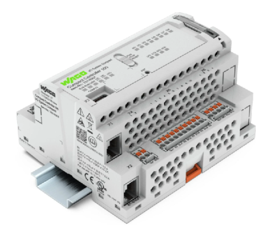

# Notes about Wago Compact Controller 

## [Wago Compact Controller](https://www.wago.com/global/plcs-%E2%80%93-controllers/compact-controller-100/p/751-9301)

- Linux based industrial Controller
- 8 x Digital Input (24V)
- 4 x Digital Output (24V)
- 2 x Analog Input (10V)
- 2 x Analog Output (10V)
- 2 x Temperature Sensor Pt1000/Ni1000 Input
- 2 x Ethernet Port
- RS485 Port

## Nodes for CC100

|Module-Node|Function|
|---|---|
|[@redplc/node-red-wago-cc100-io](https://www.npmjs.com/package/@redplc/node-red-wago-cc100-io)|Node-RED nodes for Wago CC100 I/O using with redPlc nodes.|

## How To's
### [Update Firmware](UpdateFirmware.md)
### [Adjust Settings](AdjustSettings.md)
### [Install Node-Red on Docker](InstallNodeRedDocker.md)

